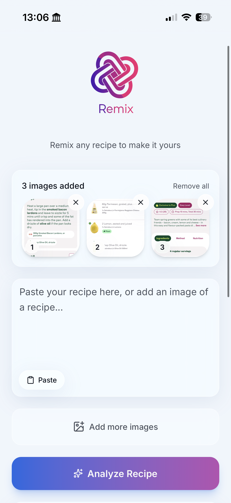
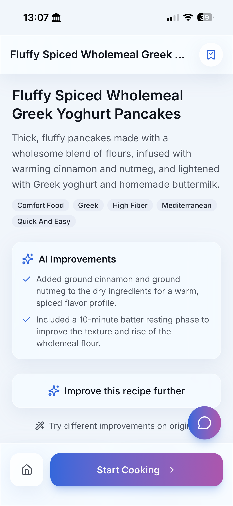
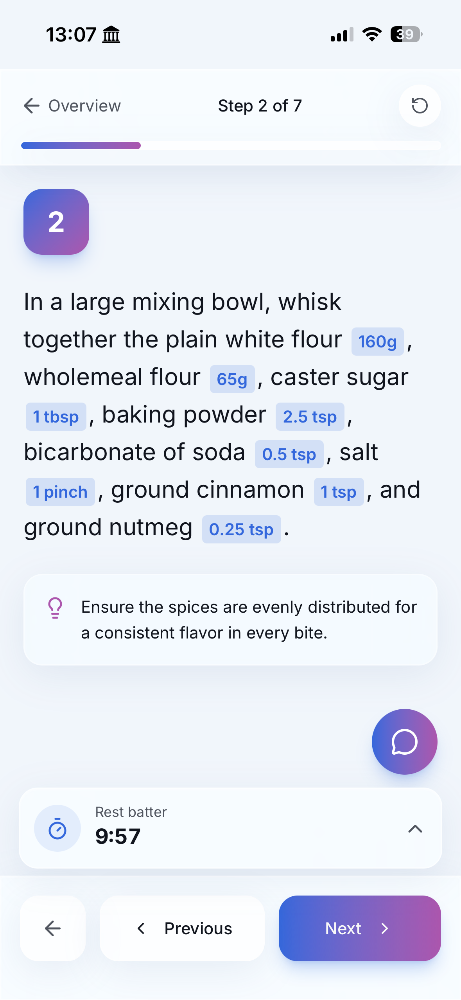

# Remix — AI-powered Recipe Remixer

Remix is a mobile-first cooking companion for importing recipes, adapting them to the way you want to cook, saving the result, and using it in a kitchen-friendly interface.

Paste a recipe or add screenshots, choose useful changes, then scale servings, swap or remove ingredients, save recipes, and run cooking timers without having to return to the original source.

## Why I built this

I was already using ChatGPT to adapt recipes I found online — changing quantities, swapping ingredients, simplifying methods, or improving them to suit how I actually cook.

The problem was that the useful version of the recipe then lived inside a chat.

I couldn't easily save the edited recipe, and the chat interface wasn't a particularly good cooking interface either. While cooking, I didn't want to keep scrolling backwards and forwards between ingredients, quantities, and method steps.

I also wanted something cleaner than many recipe websites, where the actual recipe can be buried beneath ads, pop-ups, and long-form content.

Remix grew out of those frustrations: a place to import a recipe, turn it into structured recipe data, adapt it, save it, and then actually cook from it.

## Product flow

### 1. Import a recipe

<a href="docs/screenshots/import-recipe.PNG">
  
</a>

Paste recipe text or add screenshots and Remix turns the source material into structured recipe data.

### 2. Adapt it

<a href="docs/screenshots/ai-improvements.PNG">
  
</a>

Suggested changes can be reviewed and applied while keeping the recipe structured and editable.

### 3. Cook from it

<a href="docs/screenshots/cooking-mode.PNG">
  
</a>

Cooking mode puts quantities directly into the instructions, breaks the method into clear steps, and keeps timers alongside the work.

## Features

- **Recipe input** — paste text or upload/photograph a recipe image
- **Recipe parsing** — turns source material into structured ingredients and instructions
- **AI suggestions** — options such as healthier, tastier, kid-friendly, easier, faster, vegetarian, budget-friendly, or better-presented
- **Interactive recipe view** — step-by-step instructions with inline measurements
- **Serving scaler** — adjusts ingredients and relevant instructions proportionally
- **Ingredient swaps** — suggests alternatives and applies the chosen replacement throughout the recipe
- **Ingredient removal** — adapts the recipe to work without a selected ingredient
- **Saved recipe library** — favourites, recents, search, and tag filtering
- **Cooking timers** — per-step timers with audio alerts, notifications, wake lock, and vibration
- **Push notifications** — timer alerts via web push when the app is backgrounded or the phone is locked, including iOS PWA support
- **Offline support** — service worker caching for the app shell
- **Persistence** — saved recipes stored in Supabase
- **Dark mode** — full light/dark theme support

## AI and application architecture

Model requests are routed through **Vercel AI Gateway** using the Vercel AI SDK.

AI is used for tasks where semantic interpretation is useful: parsing source recipes, suggesting changes, transforming recipes, finding ingredient alternatives, and validating custom requests.

The application keeps those outputs behind typed and validated boundaries rather than treating free-form model responses as application state. Persistence, timers, UI state, serving calculations, and other deterministic behaviour remain in application code.

## Tech stack

| Layer | Technology |
| --- | --- |
| Framework | Next.js 16 (App Router) + React 19 |
| AI | Vercel AI SDK + AI Gateway |
| Styling | Tailwind CSS v4 |
| UI Components | shadcn/ui / Radix primitives |
| Validation | Zod |
| Database | Supabase (PostgreSQL) |
| Push | web-push (VAPID) + Service Worker |
| Scheduling | QStash |
| Package Manager | pnpm |

## Getting started

### Prerequisites

- Node.js 18+
- pnpm
- a Supabase project
- a Vercel AI Gateway key

### Setup

```bash
git clone <repo-url>
cd ai-recipe-app
pnpm install
cp .env.example .env.local
pnpm dev
```

Then open [http://localhost:3000](http://localhost:3000).

Environment variables are documented in [`.env.example`](.env.example).

Set up the database by running the migration scripts in your Supabase SQL editor.

## Scripts

```bash
pnpm dev      # Start development server
pnpm build    # Production build
pnpm start    # Production server
pnpm lint     # Run ESLint
```

## Project structure

```text
app/
  page.tsx              # Main app/product entry point
  api/                  # AI-powered API routes and backend actions
  layout.tsx            # Root layout with metadata/fonts
components/
  recipe-input.tsx      # Text/image recipe input
  improvement-suggestions.tsx
  recipe-display.tsx    # Interactive recipe view
  saved-recipes.tsx     # Saved recipe/library UI
  ui/                   # Shared UI primitives
hooks/
  use-timers.ts         # Multi-timer system with audio/notifications/push
lib/
  push-utils.ts         # Push-notification utilities
  recipe-types.ts       # Core TypeScript interfaces
  supabase/             # Supabase browser/SSR setup
public/
  sw.js                 # Service worker (caching + push notifications)
scripts/
  *.sql                 # Database migrations
```

## Configuration

Credentials and local environment files are intentionally kept out of source control. Provide your own Supabase, AI Gateway, push, and QStash credentials through environment variables when running or deploying the app.
