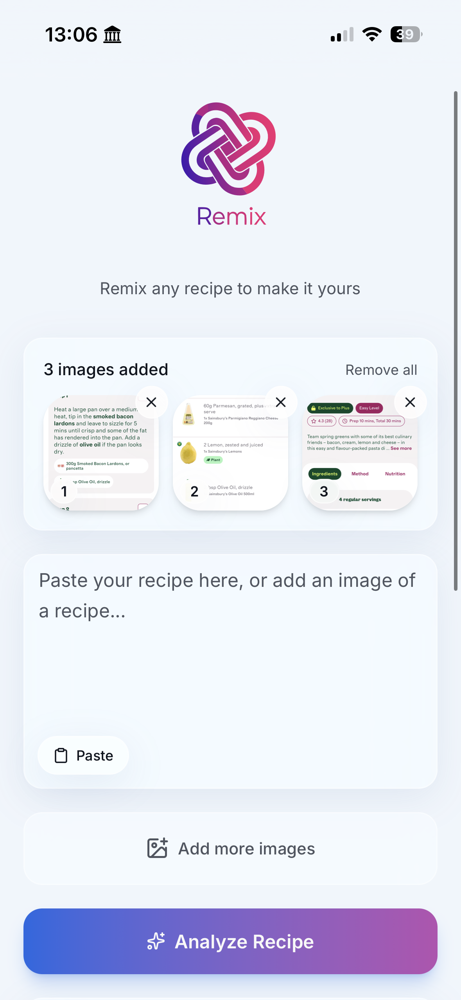
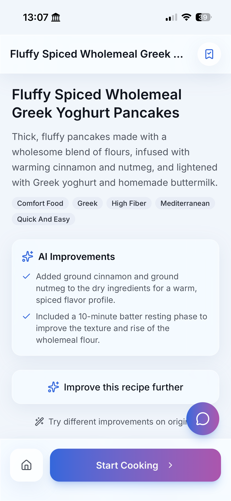
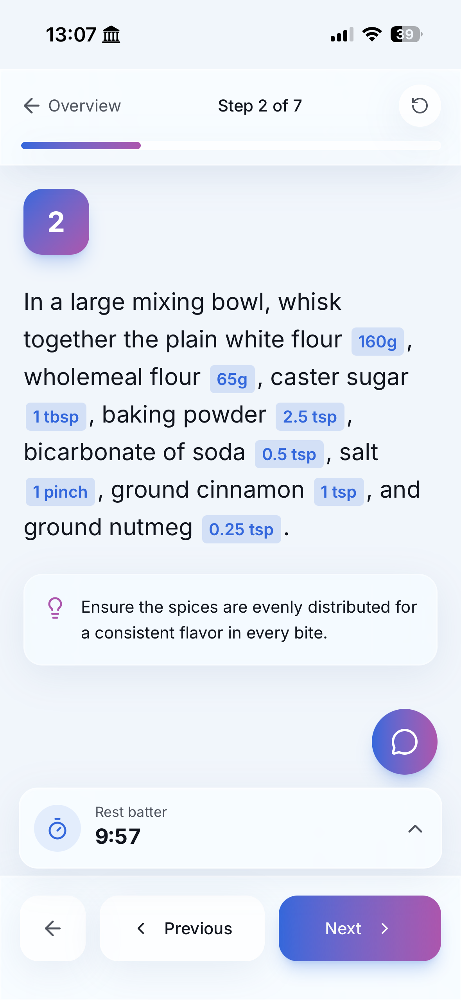

# Remix — AI-powered Recipe Remixer

Remix is a mobile-first cooking companion for importing recipes, adapting them to the way you want to cook, saving the result, and using it in a kitchen-friendly interface.

Paste a recipe or add screenshots, choose useful changes, then scale servings, swap or remove ingredients, save recipes, and run cooking timers without having to return to the original source.

## Why I built this

I was already using ChatGPT to adapt recipes I found online — changing quantities, swapping ingredients, simplifying methods, or improving them to suit how I actually cook.

The problem was that the useful version of the recipe then lived inside a chat.

I couldn't easily save the edited recipe, and the chat interface wasn't a particularly good cooking interface either. While cooking, I didn't want to keep scrolling backwards and forwards between ingredients, quantities, and method steps.

I also wanted something cleaner than many recipe websites, where the actual recipe can be buried beneath ads, pop-ups, and long-form content.

Remix grew out of those frustrations: a place to import a recipe, turn it into structured recipe data, adapt it, save it, and then actually cook from it.

## Product flow

### 1. Import a recipe

<a href="docs/screenshots/import-recipe.PNG">
  
</a>

Paste recipe text or add screenshots and Remix turns the source material into structured recipe data.

### 2. Adapt it

<a href="docs/screenshots/ai-improvements.PNG">
  
</a>

Suggested changes can be reviewed and applied while keeping the recipe structured and editable.

### 3. Cook from it

<a href="docs/screenshots/cooking-mode.PNG">
  
</a>

Cooking mode puts quantities directly into the instructions, breaks the method into clear steps, and keeps timers alongside the work.

## Features

- **Recipe input** — paste text or upload/photograph a recipe image
- **Recipe parsing** — turns source material into structured ingredients and instructions
- **AI suggestions** — options such as healthier, tastier, kid-friendly, easier, faster, vegetarian, budget-friendly, or better-presented
- **Interactive recipe view** — step-by-step instructions with inline measurements
- **Serving scaler** — adjusts ingredients and relevant instructions proportionally
- **Ingredient swaps** — suggests alternatives and applies the chosen replacement throughout the recipe
- **Ingredient removal** — adapts the recipe to work without a selected ingredient
- **Saved recipe library** — favourites, recents, search, and tag filtering
- **Cooking timers** — per-step timers with audio alerts, notifications, wake lock, and vibration
- **Push notifications** — timer alerts via web push when the app is backgrounded or the phone is locked, including iOS PWA support
- **Offline support** — service worker caching for static assets
- **Persistence** — saved recipes stored in Supabase
- **Single-user login** — the whole app sits behind Supabase email/password auth, with a long-lived session
- **Demo mode** — skip the login to explore with bundled sample recipes; no AI calls, no database access
- **Dark mode** — full light/dark theme support

## AI and application architecture

Model requests are routed through **Vercel AI Gateway** using the Vercel AI SDK.

AI is used for tasks where semantic interpretation is useful: parsing source recipes, suggesting changes, transforming recipes, finding ingredient alternatives, and validating custom requests.

The application keeps those outputs behind typed and validated boundaries rather than treating free-form model responses as application state. Persistence, timers, UI state, serving calculations, and other deterministic behaviour remain in application code.

## Tech stack

| Layer | Technology |
| --- | --- |
| Framework | Next.js 16 (App Router) + React 19 |
| AI | Vercel AI SDK + AI Gateway |
| Styling | Tailwind CSS v4 |
| UI Components | shadcn/ui / Radix primitives |
| Validation | Zod |
| Database | Supabase (PostgreSQL) |
| Push | web-push (VAPID) + Service Worker |
| Scheduling | QStash |
| Package Manager | pnpm |

## Getting started

### Prerequisites

- Node.js 18+
- pnpm
- a Supabase project
- a Vercel AI Gateway key

### Setup

```bash
git clone <repo-url>
cd ai-recipe-app
pnpm install
cp .env.example .env.local
pnpm dev
```

Then open [http://localhost:3000](http://localhost:3000).

Environment variables are documented in [`.env.example`](.env.example).

Set up the database by running the migration scripts in `scripts/` in your Supabase SQL editor, in order.

### Create your user

The app is single-user and has no sign-up flow — create the one account by hand:

1. In the Supabase dashboard, go to **Authentication → Users → Add user**.
2. Enter an email and password, and enable **Auto Confirm User** so no email verification is needed.

You can then sign in at `/login`. Sessions are refreshed on every request, so you stay signed in indefinitely unless you sign out (or configure a session timeout under **Authentication → Sessions**).

### Demo mode

`/login` offers a **Try the demo** option for anyone you share the link with. Demo mode sets a cookie and runs the same routes against bundled fixtures:

- Sample recipes come from `lib/demo/fixtures/recipes.ts`, and saves, favourites, deletions and meal plans are written to `localStorage` — never to Supabase.
- AI features return pre-written responses from `lib/demo/fixtures/ai.ts`, so no AI Gateway tokens are spent. Every AI route independently returns `401` without a session.
- Serving scaling and cooking timers run for real, since they're pure client-side logic.
- Live recipe Q&A is the one feature behind the login, because it streams from the model in real time.

### Security note

The login gates the **app**, not the data. `NEXT_PUBLIC_SUPABASE_ANON_KEY` ships to the browser and row-level security is deliberately permissive (see `scripts/005_document_actual_schema.sql`), so anyone who copies the key from devtools can reach the Supabase REST API directly. That's an accepted trade-off for a single-user personal app. The upgrade path — populate `user_id`, add one to `meal_plan_entries`, and restore `auth.uid() = user_id` policies — is documented in that migration.

## Scripts

```bash
pnpm dev      # Start development server
pnpm build    # Production build
pnpm start    # Production server
pnpm lint     # Run ESLint
```

## Project structure

```text
app/
  page.tsx              # Main app/product entry point
  login/                # Sign-in page and auth server actions
  api/                  # AI-powered API routes and backend actions
  layout.tsx            # Root layout with metadata/fonts
proxy.ts                # Auth gate (Next.js 16 middleware convention)
components/
  recipe-input.tsx      # Text/image recipe input
  improvement-suggestions.tsx
  recipe-display.tsx    # Interactive recipe view
  recipe-highlights.tsx # Saved recipe favourites/recents on the home screen
  demo/                 # Client-side loaders used only in demo mode
  ui/                   # Shared UI primitives
hooks/
  use-timers.ts         # Multi-timer system with audio/notifications/push
lib/
  ai/fetch.ts           # The single seam between the app and the AI routes
  auth/require-user.ts  # Server-side session guard for API routes
  data/                 # Repository layer: Supabase and demo backends
  demo/                 # Demo flag, localStorage store, and fixtures
  push-utils.ts         # Push-notification utilities
  recipe-types.ts       # Core TypeScript interfaces
  supabase/             # Supabase browser/SSR setup
public/
  sw.js                 # Service worker (caching + push notifications)
scripts/
  *.sql                 # Database migrations
```

## Configuration

Credentials and local environment files are intentionally kept out of source control. Provide your own Supabase, AI Gateway, push, and QStash credentials through environment variables when running or deploying the app.
